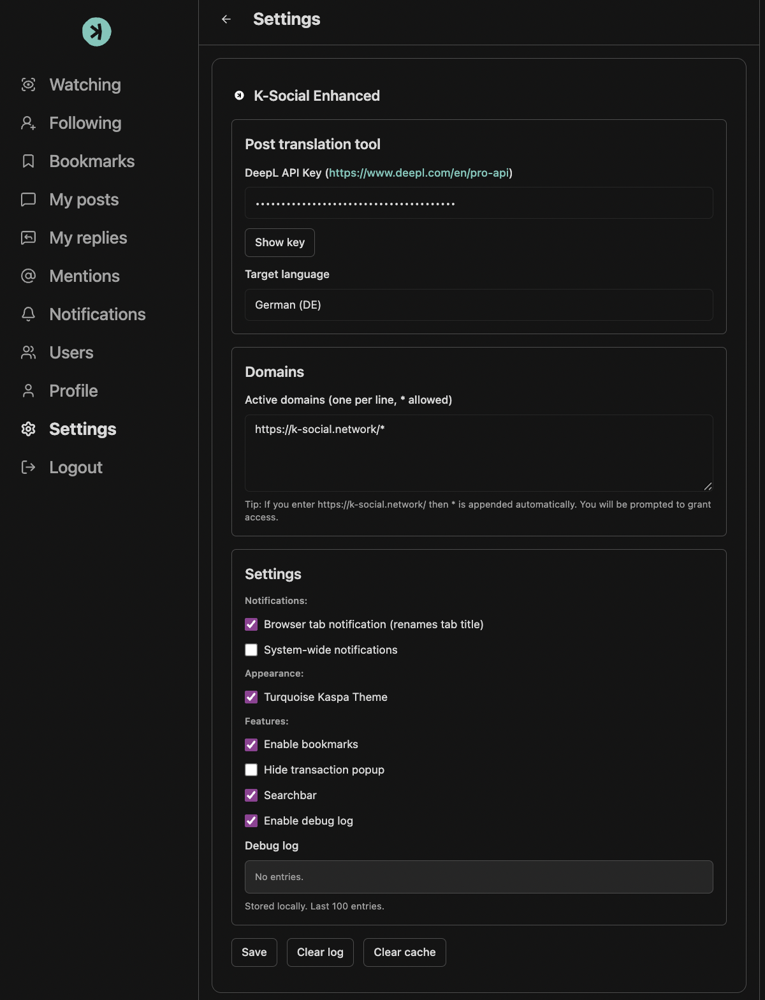

# K-Social-Enhanced v0.1.2 (Browser Extension)
K-Social Enhanced expands k-social.network with practical convenience features, a tidy interface and useful customisations for your daily workflow. Quick to install, slim in the background – for a more focused user experience.

## Tutorial
### 1. Open Chrome Extensions

Open Google Chrome

Go to: chrome://extensions/
(You can also click the three-dot menu → Extensions → Manage Extensions)

### 2. Enable Developer Mode

In the top-right corner of the Extensions page, toggle Developer mode ON

### 3. Install K-Social Enhanced

Click Load unpacked.

Select the folder that contains the K-Social Enhanced extension files

Confirm the selection

### 4. Usage
Go to: https://k-social.network/

There you find "Settings" in the left sidebar
